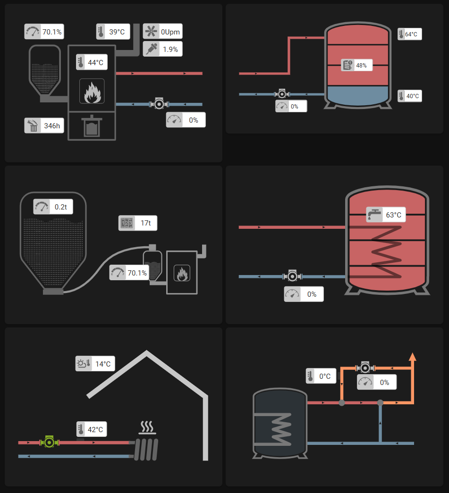

# Froeling Card

A custom Home Assistant card for visualizing and interacting with Froeling systems. This card provides a visual representation of various Froeling components, such as boilers, pumps, and sensors, using SVG graphics and dynamic updates based on Home Assistant entities.

[](#)

## Features
- Dynamic SVG updates based on Home Assistant entity states.
- Support for multiple Froeling components (e.g., boiler, buffer, circulation pump).
- Easy integration with Home Assistant Lovelace dashboards.

## Installation

### Option 1: Installation via HACS
1. Ensure that [HACS](https://hacs.xyz/) is installed in your Home Assistant setup.
2. Add this repository to HACS as a custom repository:
   - Go to HACS > Add custom Repository.
   - Enter the GitHub URL of this repository.
3. Search for "Froeling Card" in HACS and install it.
4. Restart Home Assistant.

### Option 2: Manual Installation
1. Download the latest release from the [GitHub releases page](https://github.com/GyroGearl00se/lovelace-froeling-card/releases).
2. Copy the `dist` folder to your Home Assistant `www/custom_cards/froeling-card/` directory.
3. Add the following to your `configuration.yaml`:

```yaml
lovelace:
  resources:
    - url: /local/custom_cards/froeling-card/dist/froeling-card.js
      type: module
```

4. Restart Home Assistant.

## Usage

Add the card to your Lovelace dashboard and configure your entities accordingly.


## License

This project is licensed under the MIT License. See the LICENSE file for details.
